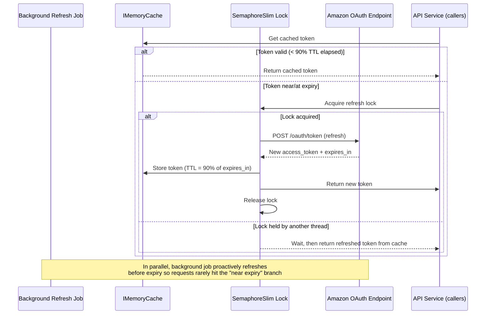
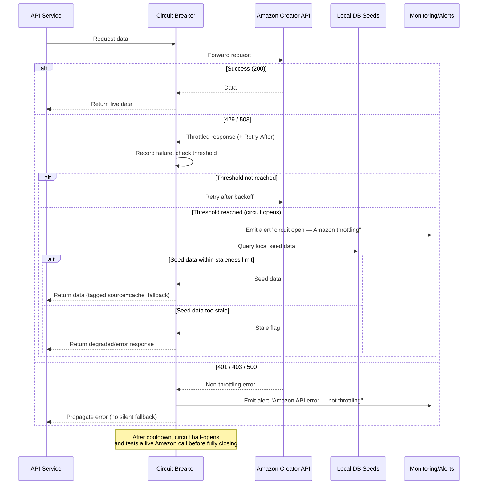

# Amazon Key Integration — Open Questions Resolution

**Status:** Proposed for review
**Scope:** OAuth token caching strategy and API rate-limit fallback behavior for the Amazon Creator API v3.2 integration
**Infrastructure:** Backend hosted on Render.com; database is PostgreSQL

---

## 1. OAuth Token Caching

### Decision
Approved, with the following refinements to the original proposal:

| Aspect | Approach |
|---|---|
| Cache store | `IMemoryCache` (per-instance). Switch to a distributed cache (e.g., Redis) only if multiple app instances must share a single token. |
| Effective TTL | 90% of Amazon's reported `expires_in` (e.g., ~3240s for a 3600s token) — leaves a safety buffer against clock drift and in-flight requests. |
| Refresh trigger | Proactive background refresh (hosted service / timer), **not** refresh-on-cache-miss on the request path — avoids adding auth latency to user-facing calls. |
| Concurrency control | `SemaphoreSlim` (double-checked locking) around the refresh call to prevent a "thundering herd" of simultaneous refresh calls when the cache entry expires. |
| Failure handling | If a refresh call fails, keep serving the last known-good token for a short grace window while retrying with exponential backoff, rather than blocking all outbound Amazon calls immediately. |
| Metadata stored | Token, `issued_at`, `expires_at`, refresh token (if supported by Amazon's OAuth flow) — enables refresh-token rotation instead of full re-auth each cycle. |

### Open item requiring confirmation
Confirm whether this service runs as a single instance or is horizontally scaled. If scaled, decide:
- **Multiple independent tokens (one per instance)** — simplest, generally fine since Amazon allows concurrent valid tokens, or
- **Single shared token (distributed cache)** — reduces total auth calls to Amazon, adds Redis dependency.

### Render.com-specific notes
- **Deploys and restarts wipe the in-memory cache.** Render restarts the service on every deploy, and on plans that scale to zero (free/idle tier) an idle instance spinning back up also starts with a cold cache. Expect a token fetch immediately after any restart — this is expected behavior, not a defect, and should be called out so it isn't mistaken for a bug during on-call review.
- **Horizontal scaling means multiple independent caches.** If the service runs as more than one Render instance, each instance holds its own `IMemoryCache` and independently fetches/refreshes its own token. This is acceptable as long as Amazon permits multiple concurrent valid tokens per client credential (worth a one-time confirmation with Amazon's API docs/support).
- **If a shared token becomes necessary** (e.g., Amazon enforces a concurrent-token limit, or we want to minimize total auth calls across instances), use Render's managed **Redis** add-on as the distributed cache instead of `IMemoryCache`. No other architectural change needed — just swap the cache provider.

### Sequence: Token Refresh Flow

---

## 2. API Rate Limit / Throttling Fallback

### Decision
Approved **with scoping and guardrails** — a blanket "fallback on any failure" is not recommended, as it risks silently serving stale data without visibility.

| Aspect | Approach |
|---|---|
| Trigger condition | Fallback only on `429 Too Many Requests` and `503 Service Unavailable`. Auth errors (`401`/`403`) and server errors (`500`) should fail loudly / alert, not silently fall back. |
| Backoff | Honor Amazon's `Retry-After` header before retrying; don't immediately fall back on the first `429`. |
| Circuit breaker | Use a circuit breaker (e.g., Polly in .NET) that trips to "open" after N consecutive throttling responses, stays open for a cooldown period, then "half-opens" to test recovery. |
| Fallback source | Local DB seed data, explicitly tagged (e.g., `source: "cache_fallback"`) so downstream consumers and support teams know it isn't live data. |
| Staleness limit | Define a max acceptable age for seed data (e.g., 24h / 7d — **needs stakeholder input**). Beyond that threshold, return a degraded response/error instead of silently serving very stale data. |
| Observability | Emit a metric/log/alert whenever fallback is activated or the circuit breaker trips, so the integration's degraded state is visible to ops — not a silent failure mode. |

### Open item requiring confirmation
**Maximum acceptable staleness of seed data** before the service should stop falling back and instead return an explicit error/degraded response to the caller.

### PostgreSQL-specific notes
- "Local DB seeds" maps directly to a Postgres table, e.g. `amazon_data_seed_cache`, with an `updated_at` / `fetched_at` timestamp column — this timestamp is what drives the staleness check above.
- **Keep the seed table fresh continuously, not just during fallback.** On every successful live Amazon call, upsert the corresponding rows in `amazon_data_seed_cache` in the background. If the table is only written to during fallback events, its data is only ever as fresh as the last outage — which defeats the purpose of a fallback.
- Add an index on the lookup key (e.g., SKU / product ID / listing ID) so fallback reads stay fast precisely when they're needed most — i.e., while Amazon is degraded and live traffic is still flowing.
- Circuit breaker (e.g., Polly, if .NET) queries Postgres directly on trip — no additional infrastructure required beyond the existing database.

### Sequence: Rate-Limit Fallback Flow

---

## Summary for Sign-off

| # | Question | Resolution | Needs stakeholder input |
|---|---|---|---|
| 1 | OAuth token caching | Approved — `IMemoryCache` on Render, 90% TTL, proactive background refresh, mutex-protected. Redis add-on only if multi-instance token sharing is required. | Confirm Render instance count (single vs. horizontally scaled) and whether Amazon caps concurrent tokens |
| 2 | Rate-limit fallback | Approved — scoped to 429/503, circuit breaker, fallback backed by Postgres `amazon_data_seed_cache` table kept fresh via background upserts, tagged stale responses, alerting | Max acceptable seed-data staleness threshold |
